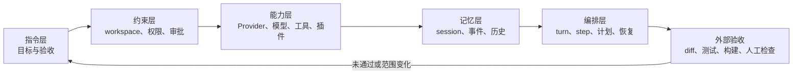

# 五层模型：把 dsh 变成可控的执行系统

很多人第一次接触 Harness，会先记命令、记模型名、记工具名。真正决定一次任务是否可控的，是五层东西能不能对齐：任务说清楚了吗，边界锁住了吗，能力真的加载了吗，状态能不能解释，编排是否可恢复。

一些 Harness 方法论资料也用“指令、约束、能力、记忆、编排”五个组件来解释系统。这里不把外部资料当作 dsh 的 API，而是把这五个概念映射到 DeepSeek Harness 的实际对象，方便读者在一条主线上理解后面的 Web、CLI、SDK 和插件章节。

## 五层和 dsh 对象的对应关系

| 层 | 要回答的问题 | dsh 中需要检查的对象 | 本手册入口 |
| --- | --- | --- | --- |
| 指令层 | 这次任务到底要交付什么？ | 目标、范围、不变量、验收、停止条件 | [任务契约](../core/task-contract.md) |
| 约束层 | Agent 可以看到、修改、执行和联网到哪里？ | workspace、cwd、权限、审批、沙箱、网络和凭据 | [权限](../06-security/permissions.md) |
| 能力层 | 它实际拥有哪种模型、工具和扩展？ | Provider、模型、工具 schema、profile、bundle、插件 | [工具目录](../09-tools/catalog.md)、[插件模型](../10-plugins/plugin-model.md) |
| 记忆层 | 哪些上下文会被保存、重放或带到下一步？ | session、事件、历史、持久 Shell、日志、fork | [Session 模型](../07-sessions/model.md) |
| 编排层 | 谁决定下一步，失败后如何继续或停止？ | turn、step、计划、子 Agent、Web/CLI/SDK 生命周期 | [工具执行流水线](../09-tools/execution-pipeline.md) |

这五层不是五个独立开关。一次任务的实际行动空间是它们的交集：模型很强，但没有编辑工具，就不能完成写入；工具已经加载，但 workspace 是只读，也不能完成修改；任务文本说了“完成”，但没有外部验收，仍然不能证明交付。



## 1. 指令层：把“帮我做好”改成任务契约

指令层不是写得越长越好，而是让 Agent 能判断什么时候应该继续、什么时候必须停。

最小任务契约至少包含：

```text
目标：最终要交付什么
范围：允许读取和修改哪些位置
不变量：哪些行为、接口和文件不能改变
权限：允许哪些工具、命令、网络和凭据
验收：哪些外部检查通过才算完成
停止：什么情况必须暂停并询问
交付：最后报告哪些事实、结果和风险
```

“不要改太多”不是可验收的边界；“只允许修改 src/ 和对应测试，不改依赖，完成后运行指定测试”才是。完整模板见[任务契约](../core/task-contract.md)和[参考模板](../12-reference/templates.md)。

## 2. 约束层：把行动空间锁在可恢复范围内

约束层决定 Agent 的行动能不能造成不可逆后果。开始任务前逐项确认：

- workspace 是不是预期的 checkout 或副本；
- cwd 是否与任务假设一致；
- 当前 profile 是否加载了写入、Shell、联网或委派能力；
- 需要审批的动作会不会直接执行；
- 凭据是否只通过受控引用提供；
- 任务是否应该在临时目录、容器或独立分支中运行。

权限不是提示词里的愿望。任务写了“不要访问其他目录”，不等于进程层面已经阻止访问；实际边界要结合 profile、沙箱、工作区和操作系统权限检查。相关做法见[数据流](../06-security/data-flow.md)和[威胁模型](../06-security/threat-model.md)。

## 3. 能力层：区分“已声明”与“真实可用”

Provider、模型和工具的名称只是目录信息，不是成功证明。至少要分别确认：

1. Provider ID、协议、端点和凭据引用；
2. 模型 ID、输入模态和当前 session 的模型记录；
3. 当前 profile 实际加载的工具 schema；
4. 插件注册了哪些事件、服务、工具和权限；
5. 低风险任务是否能完成一次真实请求和工具调用。

例如，配置里声明了 `image`，只能说明配置声称支持图片，不能证明端点真的接受图片。工具目录中出现 `bash`，也不能说明当前任务一定获得了执行权限。Provider 和工具都要按当前版本的实际配置、帮助和结果复核。

## 4. 记忆层：把 session 当作状态，不当作聊天窗口

session 可能携带模型选择、工具事件、持久 Shell、错误上下文和图片输入。继续旧 session 的好处是保留背景，代价是旧状态也会继续影响行为。

需要新建 session 的典型情况：

- workspace、Provider、模型或权限改变；
- 旧 session 已经出现错误或敏感输入；
- 任务目标发生变化；
- 需要清空持久进程或错误的工具上下文；
- 无法确认恢复点对应哪一个实际 diff。

恢复时至少保存最后一个可靠检查点、workspace、session、模型、权限、当前 diff 和外部验证结果。详见[Session 生命周期](../core/session-lifecycle.md)和[恢复手册](../07-sessions/recovery.md)。

## 5. 编排层：让多步工作有检查点和停止条件

编排层处理的不是“让模型多想几次”，而是把观察、行动、验证和恢复连起来。一个可控的任务通常按下面的顺序推进：

```text
读取基线
  → 只读理解
  → 提出范围和计划
  → 获得必要审批
  → 最小修改
  → 独立验证
  → 检查 diff 和外部结果
  → 交付或恢复
```

Web、CLI 和 SDK 只是不同入口，不能改变这个闭环。Headless 可以自动退出，不代表业务验收自动通过；SDK 可以返回 `final_response`，也不代表测试、diff 和数据流已经通过。

## 发出任务前的五个问题

如果下面五个问题有一个答不出来，先不要扩大权限：

1. Agent 这次能读取和修改什么？
2. Provider、模型和工具是按哪一份实际配置加载的？
3. 哪些状态会保存到 session 或日志？
4. 哪个动作需要审批，哪个动作必须停止？
5. 最终由哪个外部检查证明任务完成？

## 按五层模型定位问题

| 现象 | 先查哪一层 | 不要先做什么 |
| --- | --- | --- |
| 服务启动不了 | 约束层、入口和配置层 | 不要先换模型或重试任务 |
| 模型不可用 | 能力层：Provider、凭据、模型 ID | 不要把错误 key 反复写进任务 |
| Agent 看不到或改不了文件 | 约束层：workspace、cwd、权限和工具 | 不要直接提升到全权限 |
| 旧上下文干扰新任务 | 记忆层：session、持久 Shell、事件 | 不要只改最后一条提示词 |
| 任务跑偏或无限继续 | 指令层、编排层和停止条件 | 不要用更长的 prompt 掩盖边界缺失 |
| 最终回答说完成，但项目不对 | 编排层的外部验收 | 不要把自报结果当测试结果 |

接下来不要按目录从头背完。先走[从空白 workspace 到可验收交付](../05-workflows/from-blank-to-delivery.md)，再回到对应章节查 Provider、Session、工具、自动化和插件细节。

## 这页的边界

五层模型是本手册的阅读框架和操作归纳，不是 dsh 新增的配置字段，也不是对任何一次运行结果的报告。具体命令、字段和能力仍以当前版本的 `--help`、官方文档和独立验收为准。
